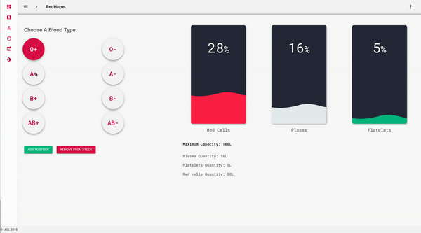

# Redhope

## Introduction

- Redhope is a platform built for blood transfusion centers, to manage their stock, and help manage the process
of creating events or publication to tell people about blood donation campaign, and also to facilitate collecting data
about possible donors, in all regions of morocco.

- This project is developed under the competition of **Injaz al maghrib** and it was placed 2end in the final competition
in casablanca as the most innovative junior enterprise project .

## deployment

- To be able to deploy the application, you need `java` and an application server (we use `wildfly`), setup your datasource
as in the `persistence.xml` file, and just build the project using `maven` and deploy the generated `redhope.war`.

- for the `user-ui` and `redhope-admin` modules, just run `npm install` and `npm run dev` to run in development
 